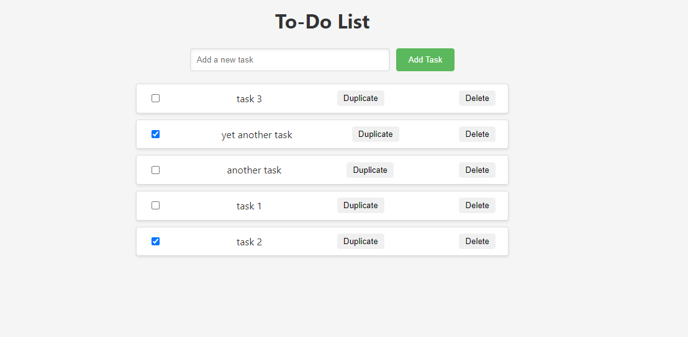

# To-Do List Application

A very simple and basic To-Do List application built with Node.js, Express, and MongoDB. This application demonstrates CRUD operations in a RESTful API and offers both local and Dockerized deployment options.

## Features

- Create, read, update, and delete to-do items.
- Persistent storage with MongoDB Atlas.
- Easy deployment with Docker.



## Prerequisites

- Node.js and npm
- Docker (for Dockerized deployment)
- MongoDB Atlas account for database

## MongoDB Atlas Setup

1. Sign up or log in to [MongoDB Atlas](https://www.mongodb.com/cloud/atlas).
2. Create a new cluster.
3. In the "Database Access" section, add a new database user with read and write privileges.
4. In the "Network Access" section, add an IP address to whitelist or select "Allow Access from Anywhere."
5. In the "Clusters" section, click on "Connect" for your cluster. Choose "Connect your application" and copy the connection string provided.

## Configuration with .env

Create a `.env` file in the root directory and populate it with your MongoDB Atlas connection string and other configurations:

```plaintext
# MongoDB connection string
DB_CONNECTION=mongodb+srv://<username>:<password>@<cluster-address>/todoListDB?retryWrites=true&w=majority

# Port number
PORT=3000
```

Replace `<username>`, `<password>`, and `<cluster-address>` with your actual MongoDB Atlas credentials and cluster information.


## Getting Started


### Installation

Clone the repository and install dependencies:

```
git clone https://github.com/fwSara95h/todo-list-app.git
cd todo-list-app
npm install
```


### Running Locally

To start the application locally, run:

```
npm start
```

The application will be available at http://localhost:3000.

### Dockerization

#### Building the Docker Image

Build the Docker image with the following command:

```
docker build -t todo-list-app .
```


#### Running the Docker Container

Run the application using Docker with:

```
docker run -p 3000:3000 todo-list-app
```


## Contributing

Contributions are welcome! Please feel free to submit a pull request.


## License

This project is licensed under the MIT License - see the LICENSE file for details.

